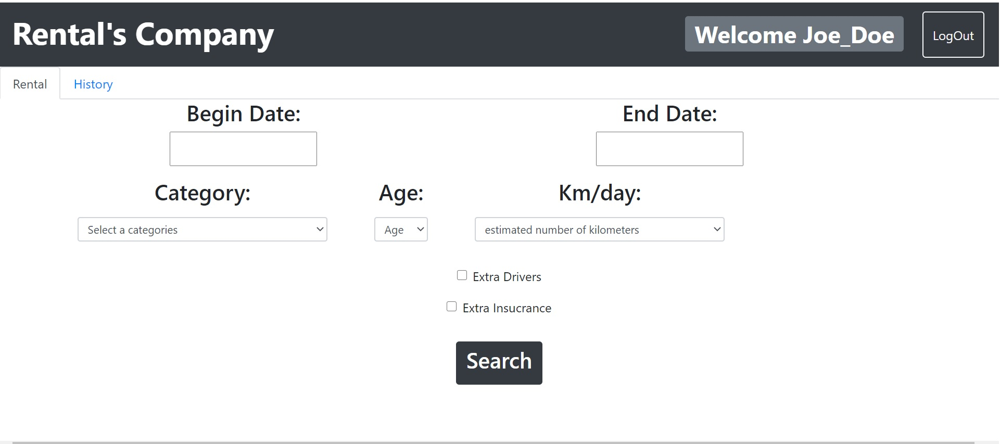

# Exam #1: "Exam Title"
## Student: s269131 FUMAROLA LUCA

## React client application routes

- Route `/visitator`: page content and purpose
- Route `/something/:param`: page content and purpose, param specification
- Route '/visitator' : Home Page, it show menu for not authenticated user
- Route '/userRental' : Page loaded when user is correctly logged In and accessible by Nav Link, It show menu for rental request with the available cars
- Route '/userHistory' : Page accessible by Nav Link, It show Past and Future rentals of the user
- Route 'userPaymente' :  Page loaded when user accept the proposal, user has to put payment information  

## REST API server

- GET '/api/visitator/cars' 
Request Parameters: None
Response Body: List of all cars grouped by Model
- GET '/api/visitator/categories'
Request Parameters: None
Response Body: List of all categories
- GET '/api/visitator/brands'
Request Parameters: None
Response Body: List of all Brands
- POST '/api/login'
Request Parameters: Username and Password 
Response Body:	It return the encrypted password of the user for authentication
- POST '/api/logout'
Request Parameters: None
Response Body: None
- GET '/api/user/cars' 
Request Parameters: None
Response Body: List of all cars (not grouped by Model)
- GET '/api/user/rentals'
Request Parameters: None
Response Body: List of all rentals, to check available cars
- GET 'api/userRental/:username'
Request Parameters: Username
Response Body: It return the number of past rentals of the user
- GET '/api/carForC'
Request Parameters: none
Response Body: List with number of cars for each categories
- GET '/api/allRentalofUser/:username'
Request Parameters: Username
Response Body: It return list of all rentals (past and future) of the user
- DELETE '/api/userRentalDelete/:idCar/:username/:beginDate/:endDate' 
Request Parameters: idCar, username, Beggining and End Date of a future rental of the user
Response Body: None               
- POST '/api/userRental/insert'
Request Parameters: Username, IdCar, Beginning and End Date of a new Rental after Payment validation
Response Body: Result of the operation

## Server database

- Table CAR - contains IdCar Model Category Brand
- Table RENTAL - contains IdCar User BeginDate EndDate
- Table USER - contains Username Password

## Main React Components

- Navbar.js : Navbar still present in visitator and user mode, it show LogIn form in first case or a "Welocme Username" Badge with a LogOut Button

- Search.js + Menu.js: It contain two buttons group with categories and brands, a Search button (to be clicked only the first time) and a Carousel
		       Menu that will appear the first time, the content will change dynamically, based on selected categories and brands

- UserHistory.js: It show two tables, the first provide expired rentals of the logged user, the second future rental, those one may be removed by
		  clicking on a button present for each row of the table

- UserSearch.js:  It contains form to be filled for searching available cars in a certain period, and with a specific category.
		  Every time the Search button is clicked, if all forms are correctly filled, it will show a table with list of available cars.
		  User may choose one of those by another form to confirm rental

- Payment.js:	  It contain several form for payment, there's a simple control that check if each form is filled

## Screenshot

## Test users

* Joe_Doe, abc123 (frequent customer)
* Bob_85, pw_eas3 (frequent customer)
* GreenStyle, appleApp
* TimotyREE, pencil_a
* Jack.Flyd, skippuy                          
